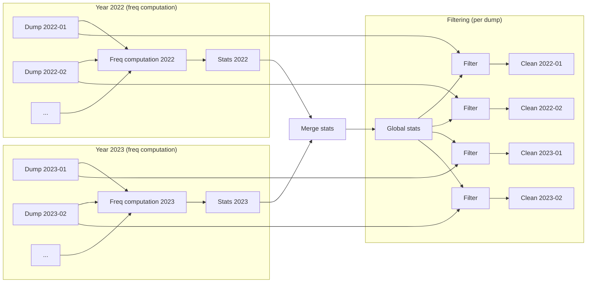

# Uzushio Deduplication Design

Uzushio detects near-duplicate paragraphs across a web corpus
and counts how often each paragraph (or something very similar to it) appears.
It then probabilistically removes documents whose paragraphs are common.
This avoids the scaling problems of traditional deduplication,
where picking a "canonical" copy of each duplicate requires
grouping all copies together, which does not scale to web-sized corpora.

| Property | MinHash + LSH | Suffix Array | CCNet | SemDeDup | Dolma/BFF | LSHBloom | **Uzushio** |
|---|---|---|---|---|---|---|---|
| Near-duplicate aware | Yes | No | No | Yes | Limited | Yes | **Yes** |
| Paragraph-level | No | Substring | Yes | No | Yes | No | **Yes** |
| No grouping/canonical selection | No | N/A | Yes | No | Yes | Yes | **Yes** |
| Deterministic & mergeable | Mostly | Yes | Yes | No | No | Mostly | **Yes** |
| Scales without skew blowup | Struggles | Struggles | Yes | Moderate | Single-machine | Yes | **Yes** |
| Tunable novelty threshold | No | No | No | No | No | No | **Yes** |

## The pipeline

| Stage | What it does | Input | Output |
|-------|-------------|-------|--------|
| Extract paragraphs | Split documents into paragraphs, strip metadata | Documents (WARC) | Paragraphs with text and position |
| Compute signatures | SimHash signature for each paragraph | Paragraphs | Paragraphs + signatures |
| Find near-duplicates | Sort by signature, sliding window scan, find near-duplicate groups. Repeat with bit rotations | Paragraphs + signatures | Paragraphs + duplicate group membership |
| Aggregate frequencies | Count paragraphs per duplicate group | Paragraphs + duplicate group membership | **Frequency statistics** (paragraph hash → frequency) |
| Merge (optional) | Merge frequency statistics from multiple runs | Multiple frequency statistics | Merged frequency statistics |
| Join + sample | Join frequencies to documents, per-document sampling decision | Documents + frequency statistics | Classified documents |

Near-duplicate detection requires sorting and multiple shuffle passes.
A yearly dump of Japanese extracted data (~500GB) runs in about 40 minutes on 400 CPU cores.
Filtering takes ~5 minutes per individual dump on a single 40-core node.

The two stages are separated by a file boundary: frequency statistics are written out,
then read back for filtering.
This separation enables merging, iteration, and independent scaling.

The frequency statistics for all of Common Crawl fit in ~100GB.
This is the only artifact that needs to be shared between runs.
By contrast, MinHash+LSH requires the full connected-component graph
(SlimPajama needed 1.4TB of RAM for this),
and suffix array methods need ~8 bytes per input byte.

Near-duplicate detection needs local storage for Spark shuffle data:
roughly 2x the input per signature rotation (local snapshots between rotations)
plus ~2x for other shuffle stages.
With 5 rotations, this totals ~10x the input size distributed across the cluster.
In principle, only the current and previous snapshot need to coexist,
but Spark does not expose an API to drop intermediate shuffle data.
This is standard Spark shuffle overhead and is freed after the job completes.

Example: processing Common Crawl with year-wise frequency computation
and dump-wise filtering.

Frequency computation runs per year (expensive, but bounded).
Merging runs once for the whole dataset.
Filtering runs per individual dump using global statistics
(cheap, and re-runnable with different parameters).

The dataset is split into partitions, processed in parallel.
Most stages operate on partitions independently.
Some stages (sorting, joining) shuffle data between partitions.
Total processing time is determined by the slowest partition,
so keeping partitions balanced is critical.

## Why paragraphs?

Web pages are not exact copies of each other.
They are recombinations of shared parts (boilerplate headers, footers, navigation, syndicated content)
mixed with varying unique content.

Uzushio works at the paragraph level.
Each paragraph gets an independent frequency:
how many times it, or something very similar to it, appears across the corpus.

Document similarity is not computed by comparing documents to each other.
A document's duplication level is derived from the frequencies of its paragraphs.
There is no document-level grouping, no canonical selection, and no document-level skew.

Paragraph-level decomposition also enables the percentile-based scoring
described below, which would not be possible with document-level frequency counts.

## Everything is deterministic

All operations in the pipeline are determined by content alone.
SimHash signatures are computed from text.
Paragraph hashes are derived from content.
Sampling thresholds are seeded from document IDs.
There is no external state, no ordering dependency, no randomness that varies between runs.

The pipeline uses this in several ways:

- **Mergeability.** The same paragraph produces the same hash in every run,
  so frequency statistics computed on separate corpus partitions can be combined.
  Frequencies can be computed per year of Common Crawl, merged,
  and used as global corpus-level statistics without processing everything at once.
- **Reproducibility.** The same input always produces the same output.
  Re-running filtering with different parameters on the same frequency data
  gives predictable, comparable results.
- **Independence.** The keep/remove decision for each document depends only
  on its content and the precomputed frequency statistics.
  No coordination between documents is needed during filtering.

## Why sampling instead of canonical selection?

Document-level deduplication gives one similarity score for the whole document.
A document is either a duplicate or it is not, and there is little control
over where the boundary is drawn.

Paragraph-level frequency data gives finer control.
A document can be kept because some of its paragraphs are novel,
even if the rest are highly redundant.
The percentile and expected frequency parameters control exactly where that tradeoff is made.

Uzushio builds on this: **deduplication is frequency-weighted probabilistic sampling.**
Each document's keep/remove decision is made independently:

- Compute a duplication score from the document's paragraph frequencies
- Generate a deterministic pseudo-random threshold seeded from the document ID
- If the score exceeds the threshold, remove the document

Documents composed of rare paragraphs are almost always kept.
Documents composed of frequent paragraphs are almost always removed.
Borderline cases are resolved probabilistically, but deterministically:
the same document always gets the same decision given the same frequency data.

### Percentile, not mean

The duplication score is the paragraph frequency at a low percentile (default: 5th),
not the mean.
Means are distorted by outliers,
and most web documents contain some extremely frequent paragraphs (boilerplate).

The percentile asks: does this document contribute anything rare?
A page that is 95% boilerplate but has 5% unique content has a low frequency at the 5th percentile,
so it survives.
A page that is duplicated even in its most unique parts gets downsampled.

## How near-duplicate detection works

The goal is to assign each paragraph a frequency that includes not just exact copies,
but near-duplicates (minor edits, whitespace changes, small variations).

### Hashing in Uzushio

Uzushio uses hashing heavily. There are four distinct types:

- **Paragraph hash**: 64-bit xxhash64 of the paragraph text.
  Used as the paragraph's identity and as join keys in frequency lookups.
  Exact duplicates share the same paragraph hash.
- **Group hash**: tracks near-duplicate group membership.
  Initially equals the paragraph hash.
  Updated to the minimum hash in the group during near-duplicate detection
  (see "Group hash propagation" below).
- **SimHash signature**: 128-bit locality-sensitive signature computed by random Gaussian projection.
  Used for sorting and approximate similarity comparison.
  This is a signature, not an identity hash — two different paragraphs can have the same signature
  without being considered duplicates (the tiered similarity checks handle that).
- **N-gram hashes**: hashes of character n-grams.
  Used as features for computing SimHash signatures.

### SimHash

Uzushio uses the SimHash algorithm (Charikar, 2002) for near-duplicate detection.
SimHash maps text to a fixed-size binary signature using random Gaussian projections.
Similar texts get similar signatures:
the Hamming distance between signatures approximates the cosine distance between texts.
For binary feature vectors (n-gram presence/absence),
cosine distance and Jaccard similarity are nearly equivalent,
so SimHash gives comparable results to MinHash in practice.

The features are character 2,3,4-gram hashes, used as seeds
to sample from the Gaussian distribution.
The default signature size is 128 bits.

### Sorting induces grouping

SimHash signatures are bit strings where similar texts differ in few bits.
Bit strings that differ in few bits are numerically close.
Sorting by signature puts similar paragraphs near each other —
not perfectly, but enough that a fixed-size sliding window catches most near-duplicates.

After sorting (O(n log n)), the window scan is O(n * w^2)
where w is the window size. 
This avoids the bucket-based grouping that LSH typically requires,
which would reintroduce skew.

### Bit rotations for recall

The sort + window scan runs within each partition independently.
Partition boundaries can split groups of near-duplicates.
Two paragraphs that differ in the high-order bits of the signature
will be far apart in sort order even if they are very similar.

To mitigate both problems, the process repeats with different bit rotations of the signature.
Each rotation produces a different sort order,
bringing different near-duplicate pairs into the same window.
The default is 5 rotations, up to 12 for larger corpora.
The rotations are delta-encoded so they chain efficiently.

### Group hash propagation

Each paragraph actually carries two hashes: its own **paragraph hash** (64-bit hash of the text)
and a **group hash** (which near-duplicate group it belongs to).
Initially the group hash equals the paragraph hash.
When two paragraphs are found to be near-duplicates,
they both receive the minimum of their group hashes.
This propagates transitively: if A matches B and B matches C,
all three converge to the same group hash.

The sliding window scan updates group hashes as it finds matches.
Each rotation can discover new near-duplicate pairs,
extending groups across partition boundaries.
After all rotations complete, the group hashes have converged.
The frequency for a group is the sum of exact frequencies of all its members,
and this is the frequency used in the sampling decision.

## Inside the sliding window

The window scan runs billions of times, so constant factors matter.

### Tiered similarity

Candidate pairs are checked using progressively more expensive methods:

1. **SimHash Hamming distance** — bitwise comparison on the signature
2. **Approximate n-gram Jaccard** — bitset-based set overlap (see below)
3. **Levenshtein distance** — exact edit distance, only for short texts

Each tier rejects non-matches before the next tier runs.

### Approximate n-gram overlap

N-gram overlap between two paragraphs is approximated using fixed-size bitsets.
Each n-gram hashes to a bit position; the bitset is the union of all n-gram hashes.
Jaccard similarity becomes `popcount(a & b) / popcount(a | b)`,
which uses bitwise operations that modern CPUs execute in single cycles (`popcnt` instruction).

This is the same idea as the hashing trick in classical language models:
map features to fixed-size arrays via hash, accept collisions, gain speed.

Different signature sizes are used depending on text length:
short texts (<=16 chars) use unigram-only signatures,
medium texts use unigram+bigram,
longer texts use full n-gram bitsets.
These are computed lazily — only when cheaper checks have not already rejected the pair.

### Length bucketing and similarity groups

Paragraphs in the window are organized into length buckets (by length / 10).
Pairs differing by more than 30% or 50 characters are skipped without comparison.
This avoids the full w^2 cost because most pairs are never compared.

When a match is found, the paragraph moves from its length bucket into a similarity group.
New candidates are checked against similarity groups first (small, cheap),
then against length buckets.
Duplicate clusters act as attractors, reducing redundant comparisons.

### Memory-aware buffering

The window size is bounded in bytes, not item count (inspired by Lucene's byte-budgeted buffers).
Each candidate row estimates its own heap size including lazy fields.
This keeps memory usage predictable regardless of text length distribution.

## Living with Zipf

Zipf's law causes problems throughout the pipeline
because a few paragraphs appear millions of times.

Shuffling assigns data to partitions by key (typically a hash of the join or sort column).
When some keys are much more frequent than others,
the partitions that receive those keys become very large
while the rest are underutilized.
A single frequent key can make one partition 50x larger than the median,
turning a 1-hour job into a 50-hour job.

Even with the sort-based approach avoiding bucket skew,
Zipf shows up again in the frequency join.
The join key is the paragraph hash, and Zipf guarantees
that a few hashes dominate, creating unbalanced partitions.

The workaround: identify the top ~100 most frequent paragraph hashes,
replace their join keys with salted (randomized) values to scatter them across partitions,
then restore the correct frequency using local counts after the join.

This sacrifices some accuracy for the highest-frequency paragraphs:
their global near-duplicate frequency is replaced with a local exact count.
These paragraphs have very high frequency regardless,
so the difference does not change the downstream sampling decision.

The general principle: **when Zipf creates skew, accept a small accuracy loss
to maintain balanced partitions.**
Because the final decision is probabilistic,
slightly imprecise frequencies for extreme outliers do not change the outcome.

## Hash collisions at scale

Paragraph identity uses 64-bit hashes.
At petabyte scale (perhaps 5*10^11 paragraphs), some collisions are expected.
A collision merges the frequency counts of two unrelated paragraphs.

The percentile-based scoring is robust to this.
A few paragraphs with falsely inflated frequencies are outliers
in the document's frequency distribution,
and the low percentile ignores outliers.
A collision would only matter if it hit a paragraph
that was both rare and near the percentile boundary of a specific document.

## How to use this

Because frequency computation takes much longer than filtering,
the two are separated by a file boundary.
Filtering parameters can be changed and re-run without recomputing frequencies.

In the recommended workflow, filtering does not discard documents.
Instead, it classifies every document by which filter would remove it and outputs all of them.
This makes it possible to inspect the output distribution and adjust parameters.

Frequency statistics are deterministic and keyed by content hash,
so results from independent runs can be combined.
A typical setup is to compute frequencies per year of Common Crawl (or any convenient split),
merge the statistics, then filter each dump using the merged global statistics.

The sampling filter can be applied multiple times with different parameters
in a single pass to produce quality tiers,
e.g. expected count 1.5 (best quality), 2.5, and 5 (most data).

The number of bit rotations controls the tradeoff between near-duplicate recall and cost.
One way to bound recall is to take a small sample where exact pairwise comparison is feasible,
run the pipeline on it, and measure what fraction of true duplicates are caught.

## Comparison with other approaches

Most systems score a document as a whole: duplicate or not.
Uzushio scores per paragraph. The percentile parameter controls
how much of a document must be novel for it to be kept.

- **MinHash + LSH** (Broder 1997; used in RefinedWeb, SlimPajama, DataTrove):
  document-level. Groups duplicates via connected components.
  Boilerplate shared across pages creates giant components that cause skew.
- **Suffix Array** (Lee et al. 2022):
  exact repeated substrings only. No near-duplicate detection.
  The suffix array is several times larger than the input.
- **CCNet** (Wenzek et al. 2020):
  paragraph-level, no grouping, scales well.
  Exact hash only — no near-duplicate detection.
- **SemDeDup** (Abbas et al. 2023):
  finds paraphrases using neural embeddings.
  Requires model inference on every document. Tested at hundreds of millions of examples.
- **Dolma/BFF** (Soldaini et al. 2024):
  paragraph-level Bloom filter. No grouping.
  Near-duplicate recall is reported to be low (Khan et al. 2024).
  Non-deterministic under parallelism. Single-machine only.
- **LSHBloom** (Khan et al. 2024):
  MinHash with Bloom filters instead of connected components. No grouping.
  Document-level only. Results depend on processing order.

## References

- Andrei Z. Broder. On the resemblance and containment of documents. SEQUENCES '97, 1997.
- Moses S. Charikar. Similarity estimation techniques from rounding algorithms. STOC '02, 2002.
- Wenzek et al. CCNet: Extracting High Quality Monolingual Datasets from Web Crawl Data. LREC 2020.
- Lee et al. Deduplicating Training Data Makes Language Models Better. ACL 2022.
- Abbas et al. SemDeDup: Data-efficient learning at web-scale through semantic deduplication. ICLR 2023.
- Penedo et al. The RefinedWeb Dataset for Falcon LLM: Outperforming Curated Corpora with Web Data, and Web Data Only. NeurIPS 2023.
- Soldaini et al. Dolma: an Open Corpus of Three Trillion Tokens for Language Model Pretraining Research. ACL 2024.
- Tolmachev et al. Uzushio: A Distributed Huge Corpus Processor for the LLM Era. 言語処理学会 第30回年次大会, 2024.
- Khan et al. LSHBloom: Memory-efficient, Extreme-scale Document Deduplication. PVLDB 19(1), 2025.
